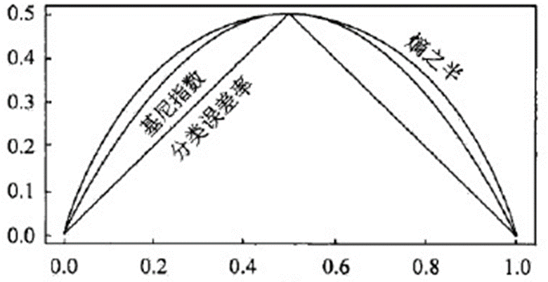
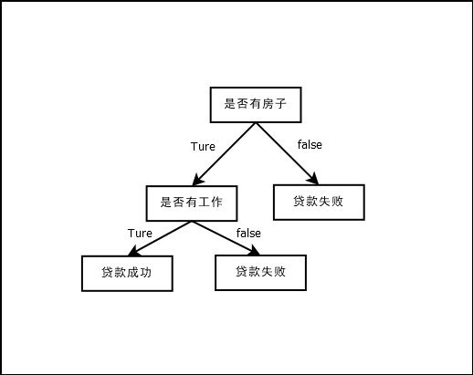

# 决策树

决策树是一种基本的回归和分类方法，属于有监督学习。在学习的时候，决策树利用损失函数最小化原则建立决策树模型，在预测时根据新的数据运用决策树模型进行分类。决策树学习通常包括特征选择、决策树生成、决策树剪枝三个部分。

---

# 决策树模型

分类决策树模型是一种描述对实例进行分类的树形结构，由结点和有向边组成。非叶子结点表示的是一个特征或者属性，叶子节点表示的是一个分类结果。

## if-then规则

决策树由根节点到叶子结点的每一条路径都是一条规则，其非叶子结点称作该路径上的规则，叶子结点表示的是该规则的分类结果，在决策树中，每一个实例有且仅被一条路径/规则所覆盖，这个性质称作互斥且完备。

## 条件概率分布

决策树还表示在给定特征下类的条件概率分布，这个条件概率分布定义在特征空间的划分上。在特征空间中将空间划分为两个不相交的区域，每个区域定义一个类的概率分布就构成了一个条件概率分布，如$P(A|B=b)$表示的是在条件$B=b$的区域下，类A的条件概率，如果在此条件$B=b$区域下，类A由$A(a_1,a_2......a_n)$组成，那么在分类时，决策树会将该结点的实例分配至条件概率大的那一个类中去，例如$A(a_1,a_2)$，$P(A=a_1|B=b) > P(A=a_2|B=b)$，那么，落入$b$区域的实例在决策树中应该属于$a_1$类。

示例：

> ```
>              5%     包含违禁品
>           /                    \
>          /                      \
>         /                        \
>        /                          \
>       /                            \
>      /                              \
>     /                                \
>   99% 报警                         1% 不报警
>      |                                |
>      |                                |
>      |                                |
>   4.95% 包含违禁品且报警     0.05% 包含违禁品且不报警
>                               /
>                              /
>                             /
>                            /
>                           /
>                          /
>                  95% 不包含违禁品
>                /                \
>               /                  \
>              /                    \
>             /                      \
>            /                        \ 
>          10% 报警                 90% 不报警
>             |                        |
>             |                        |
> 9.5% 不包含违禁品且报警    85.5% 不包含违禁品且不报警
> ```
>
> 从决策树中，我们可以计算出一些条件概率分布，例如：
>
> * P(包含违禁品|报警) = P(包含违禁品且报警) ÷ P(报警) = (4.95%) ÷ (4.95% + 9.5%) ≈ **34.25%**
> * P(不包含违禁品|不报警) = P(不包含违禁品且不报警) ÷ P(不报警) = (85.5%) ÷ (85.5% + 0.05%) ≈ **99.94%**
> * P(不报警|包含违禁品) = P(包含违禁品且不报警) ÷ P(包含违禁品) = (0.05%) ÷(5%) = **1%**
>
> 这样，我们就可以用决策树和条件概率分布来评估在安检时的各种情况和风险。
>
> [来源:Newbing]

## 决策树学习

### 特征选择

特征选择在于选取对训练数据具有分类能力的特征，是决定用哪个特征来划分特征空间。

#### 信息增益

##### 熵和条件熵

熵表示的是随机变量的不确定性的度量，熵越大，不确定性越大

$$
H(x)=- \sum_{i=1}^{n} p(x) \log p(x)
$$

条件熵表示的是在已知的随机变量X的条件下随机变量Y的不确定性。随机变量X给定的条件下随机变量Y的条件熵$H(Y|X)$定义为X给定条件下Y的条件概率分布的熵对X的数学期望

$$
H(Y|X)=\sum_{i=1}^{n}p_iH(Y|X=x_i)
$$

其中$p_i=P(X=x_i),i=1,2,3...n$，$H(Y|X=x_i) 为X=x_i$的样本子集  

##### 信息增益

表示得知特征X的信息而使得类Y的信息**不确定性减少的程度**，信息增益的定义如下，集合D的经验熵$H(D)$与特征$A$给定的条件下$D$的经验条件熵$H(D|A)$之差。（也称作互信息）

$$
g(D,A)=H(D)-H(D|A)
$$

决策树学习中**使用信息增益准则作为特征选择的标准**，在给定的训练数据集$D$和特征$A$中，经验熵$H(D)$表示的是对数据集$D$进行分类的不确定性，经验条件熵$H(D|A)$表示在特征A给定的条件下对数据集$D$进行分类的不确定性。**两者的差即为信息增益，信息增益大的特征具有更强的分类能力**。

从公式中可以得到，信息增益大并不是说H(D)一定要大，而是说H(D|A)要比H(D)小很多，也就是说，特征A可以使得数据在给定A的条件下的熵降低很多。这样，数据就更加有序和纯净了，因为每个子集中同一类别的数据占比更高了。所以，信息增益大的特征可以更好地区分不同类别的数据，具有更强的分类能力。

##### 信息增益的算法

给定数据集$D$和特征$A$，假设数据集$D$由$k$个类$C_k$，特征A有n个不同的取值：${a_1,a_2,a_3,...,a_n}$，根据特征A划分的子集有$n$个：${D_1,D_2,...,D_n}$，$D_i$为子集中的其中一个，子集$D_i$中属于类$C_k$的样本集合记作$D_{ik}$

* 首先计算数据集$D$的信息增益熵$H(D)$  

  $$
  H(D)=-\sum_{k=1}^{K}\frac{|C_k|}{|D|}log_2\frac{|C_k|}{|D|}
  $$
* 其次计算特征$A$对数据集$D$的条件经验熵$H(D|A)$  

  $$
  H(D|A)=\sum_{n=1}^{n}H(D_i)=-\sum_{i=1}^{n}\frac{|D_i|}{|D|}\sum_{k=1}^{K}\frac{|C_{ik}|}{|D_i|}log_2\frac{|C_{ik}|}{|D_i|}
  $$
* 最后计算信息增益

  $$
  g(D,A)=H(D)-H(D|A)
  $$

#### 信息增益比

信息增益比的出现是为了校正信息增益值相对于训练数据集的大小问题，信息增益值的大小没有绝对的意义，通过比值的方式可以将其进行归一化

$$
g_R(D,A)=\frac{g(D,A)}{H(D)}
$$

### 决策树生成

决策树生成的经典方法有ID3算法，C4.5算法，以及CART算法等

#### ID3算法

ID3算法的核心是在决策树各个结点上应用信息增益准则选择特征，递归的构建决策树，算法过程如下：

* 从根节点开始，对所有可能的特征计算信息增益，选择信息增益最大的特征作为节点的划分标准，生成子节点。
* 对每个子节点，重复上述步骤，递归地构建决策树。
* 直到所有特征的信息增益都小于一个阈值或者没有特征可以选择为止。

例子：

|RID|age|income|student|credit_rating|buy_compter|
| :---: | -------------| --------| ---------| ---------------| -------------|
|1|youth|high|no|fair|no|
|2|youth|high|no|excellent|no|
|3|middle_aged|high|no|fair|yes|
|4|senior|medium|no|fair|yes|
|5|senior|low|yes|fair|yes|
|6|senior|low|yes|excellent|no|
|7|middle_aged|low|yes|excellent|yes|
|8|youth|medium|no|fair|no|
|9|youth|low|yes|fair|yes|
|10|senior|medium|yes|fair|yes|
|11|youth|medium|yes|excellent|yes|
|12|middle_aged|medium|no|excellent|yes|
|13|middle_aged|high|yes|fair|yes|
|14|senior|medium|no|excellent|no|

[例题来源:[ID3算法 - liuming_1992 - 博客园 (cnblogs.com)](https://www.cnblogs.com/liuming1992/p/4256007.html)]

#### C4.5算法

C4.5算法是一种生成决策树的经典算法，是ID3算法的一种延伸和优化。它的过程如下：

* 从根节点开始，对所有可能的特征计算信息增益率，选择信息增益率最大的特征作为节点的划分标准，生成子节点。
* 对每个子节点，重复上述步骤，递归地构建决策树。
* 直到所有特征的信息增益率都小于一个阈值或者没有特征可以选择为止。
* 剪枝

#### CART算法

CART算法，全称为Classification and Regression Tree，即分类与回归树。它是一种二分递归分割的技术，把当前样本划分为两个子样本，使得生成的每个非叶子结点都有两个分支，因此CART算法生成的决策树是结构简洁的二叉树。CART算法既可以用于分类任务，也可以用于回归任务。当CART用于分类任务时，采用基尼指数作为分裂节点的依据；当CART用于回归任务时，采用样本的最小方差作为分裂节点的依据。

CART算法的步骤：

* 决策树生成：基于训练数据集生成决策树，生成的决策树和要尽量的大
* 决策树剪枝：用验证数据集对已生成的树进行剪枝并且选择最优子树，这时用损失函数最小作为剪枝的标准

> 训练集、测试集、验证集：
>
> 训练集和测试集是机器学习中常用的两种数据集。训练集是用于训练模型的数据，测试集是用于评估模型的泛化能力的数据。
>
> 一般来说，我们会将原始数据按照一定的比例划分为训练集和测试集，比如80%的训练集和20%的测试集。这样可以保证模型在训练过程中不会接触到测试集，从而避免过拟合或欠拟合。
>
> 有时候，我们还会使用一个验证集，它是从训练集中分出来的一部分数据，用于调整模型的超参数或选择最优的模型。
>
> [来源：Newbing]

CART和ID3的不同

* 二元划分：

  二叉树不易产生数据碎片，精确度往往也会高于多叉树

* CART中选择变量的不纯性度量：

  * 分类目标：Gini指标、Towing、order Towing

  * 连续目标：最小平方残差、最小绝对残差

* 剪枝：

  用预剪枝或后剪枝对训练集生长的树进行剪枝

* 树的建立：

  * 如果目标变量是标称的，并且是具有两个以上的类别，则CART可能考虑将目标类别合并成两个超类别（双化）；
  * 如果目标变量是连续的，则CART算法找出一组基于树的回归方程来预测目标变量。

##### CART生成

决策树的生成就是递归的构建二叉决策树的过程。

##### 分类树

###### 基尼指数

分类树采用的是基尼指数选择最优特征，同时决定该特征的最优二值切分点。

$$
Gini(p) = 1 - \sum_{k=1}^{K}p_k(1-p_k)=1 - \sum_{k=1}^{K}p_k^2
$$

对于二分类问题，若样本点属于第1个类的概率是$p$，则概率分布的基尼指数为

$$
Gini(p)=2p(1-p)
$$

对于给定的样本集合$D$，其基尼指数为：

$$
Gini(p)=1-\sum_{k-1}^{k}(\frac{|C_k|}{|D|})^2
$$

这里$C_k$是$D$中属于第$k$类的样本子集，K是类的个数

如果样本集合D根据特征A是否可以取某一可能值a被分割为$D_1$和$D_2$两部分，即

$$
D_1=\left \{ (x,y)∈ D| A(x) = a \right \} , D_2=D-D_1
$$

则在特征A的条件下，集合D的基尼指数定义为

$$
Gini(D,A)=\frac{|D_1|}{|D|}Gini(D_1)+\frac{|D_2|}{|D|}Gini(D_2)
$$

基尼指数$Gini(D)$表示集合$D$的不确定性，基尼指数$Gini(D,A)$表示经过$A=a$分割后集合D的不确定性，基尼指数越大，样本集合的不确定性也就越大



###### CART生成算法

根据训练数据集，从根结点开始，递归地对每个结点进行以下操作，构建二叉决策树：

输入：训练数据集D，停止计算条件

输出：CART决策树

*  设结点的训练数据集为D，计算现有特征对该数据集的基尼指数。此时，对**每一个特征**A，对其**可能取的每个值**a，根据样本点对A=a的测试为"是"或"否"将$D$分割成 $D_1$和$D_2$ 两部分，利用公式$Gini(D,A)=\frac{|D_1|}{|D|}Gini(D_1)+\frac{|D_2|}{|D|}Gini(D_2)$计算$A=a$时的基尼指数。

* 在所有可能的特征A以及它们所有可能的切分点a中，选择基尼指数最小的特征及其对应的切分点作为最优特征与最优切分点。依最优特征与最优切分点，从现结点生成两个子结点，将训练数据集依特征分配到两个子结点中去。

*  对两个子结点递归地调用(1)，(2)，直至满足停止条件。

* 生成CART决策树。

**算法停止计算的条件是结点中的样本个数小于预定阈值，或样本集的基尼指数小于预定阈值(样本基本属于同一类)，或者没有更多特征。**

###### 例题

根据下表建立一棵决策树

|ID|年龄（A1）|有工作（A2）|有自己的房子(A3)|信贷情况(A4)|类别|
| ----| ------------| --------------| ------------------| --------------| ------|
|1|青年|否|否|一般|否|
|2|青年|否|否|*好*|否|
|3|青年|==是==|否|*好*|是|
|4|青年|==是==|==是==|一般|是|
|5|青年|否|否|一般|否|
|6|中年|否|否|一般|否|
|7|中年|否|否|*好*|否|
|8|中年|==是==|==是==|*好*|是|
|9|中年|否|==是==|==非常好==|是|
|10|中年|否|==是==|==非常好==|是|
|11|老年|否|==是==|==非常好==|是|
|12|老年|否|==是==|*好*|是|
|13|老年|==是==|否|*好*|是|
|14|老年|==是==|否|==非常好==|是|
|15|老年|否|否|一般|否|

* **首先，求基尼指数**

  * **对于**​**$A_1$**（1 表示青年 ，2 表示中年，3 表示老年）

    $Gini(D,A_1=1)=\frac{5}{15}*(2*\frac{2}{5}*(1-\frac{2}{5}))+\frac{10}{15}*(2*\frac{7}{10}*(1-\frac{7}{10}))=0.44$  

    $Gini(D,A_1=2)=\frac{5}{15}*(2*\frac{3}{5}*(1-\frac{3}{5}))+\frac{10}{15}*(2*\frac{6}{10}*(1-\frac{6}{10}))=0.48$​

    $Gini(D,A_1=3)=\frac{5}{15}*(2*\frac{4}{5}*(1-\frac{4}{5}))+\frac{10}{15}*(2*\frac{5}{10}*(1-\frac{5}{10}))=0.44$

  * **对于**​**$A_2$**（1表示是，2表示否）

    ==$Gini(D,A_2=1)=\frac{5}{15}*(2*\frac{5}{5}*(1-\frac{5}{5}))+\frac{10}{15}*(2*\frac{4}{10}*(1-\frac{4}{10}))=0.32$==

  * **对于**​**$A_3$**（1表示是，2表示否）  

    $Gini(D,A_3=1)=\frac{6}{15}*(2*\frac{6}{6}*(1-\frac{6}{6}))+\frac{9}{15}*(2*\frac{3}{9}*(1-\frac{3}{9}))=0.27$

  * **对于**​**$A_4$**（1 表示非常好 ，2 表示好，3 表示一般）

    $Gini(D,A_4=1)=\frac{4}{15}*(2*\frac{0}{4}*(1-\frac{4}{4}))+\frac{11}{15}*(2*\frac{5}{11}*(1-\frac{5}{11}))=0.36$  

    $Gini(D,A_4=2)=\frac{6}{15}*(2*\frac{4}{6}*(1-\frac{4}{6}))+\frac{9}{15}*(2*\frac{5}{9}*(1-\frac{5}{9}))=0.47$  

    ==$Gini(D,A_4=3)=0.32$==

  **取基尼指数最小的特征作为最优特征，在最优特征中选择基尼系数最小的点作为最优切分点**
* 第一次切分：最优特征：$A_3$，最优切分点：$A_3=1$  

  * **$D_1：$**​**有自己的房子**

    |ID|年龄（A1）|有工作（A2）|有自己的房子(A3)|信贷情况(A4)|类别|
    | ----| ------------| --------------| ------------------| --------------| ------|
    |4|青年|==是==|==是==|一般|是|
    |8|中年|==是==|==是==|*好*|是|
    |9|中年|否|==是==|==非常好==|是|
    |10|中年|否|==是==|==非常好==|是|
    |11|老年|否|==是==|==非常好==|是|
    |12|老年|否|==是==|*好*|是|

    由于类别以及全为同一类“是”，无需继续切分，已到达最优，算法停止

  * **$D_2：$**​**没有自己的房子**

    |ID|年龄（A1）|有工作（A2）|有自己的房子(A3)|信贷情况(A4)|类别|
    | ----| ------------| --------------| ------------------| --------------| ------|
    |1|青年|否|否|一般|否|
    |2|青年|否|否|*好*|否|
    |3|青年|==是==|否|*好*|是|
    |5|青年|否|否|一般|否|
    |6|中年|否|否|一般|否|
    |7|中年|否|否|*好*|否|
    |13|老年|==是==|否|*好*|是|
    |14|老年|==是==|否|==非常好==|是|
    |15|老年|否|否|一般|否|

    * 对于A1

      * $Gini(D_{2},A_1=1)=\frac{4}{9}*(2*\frac{1}{4}*(1-\frac{1}{4}))+\frac{5}{9}*(2*\frac{2}{5}*(1-\frac{2}{5}))=$
      * $Gini(D_{2},A_1=2)=\frac{2}{9}*(2*\frac{0}{2}*(1-\frac{0}{2}))+\frac{6}{9}*(2*\frac{3}{6}*(1-\frac{3}{6}))=$
      * $Gini(D_{2},A_1=3)=\frac{3}{9}*(2*\frac{2}{3}*(1-\frac{2}{3}))+\frac{6}{9}*(2*\frac{1}{6}*(1-\frac{1}{6}))=$
    * 对于A2

      * $Gini(D_{2},A_2=1)=\frac{3}{9}*(2*\frac{3}{3}*(1-\frac{3}{3}))+\frac{6}{9}*(2*\frac{0}{6}*(1-\frac{0}{6}))=0$  

        Gini值为0，必定是最小结点，则取基尼系数最小的特征A2作为最优特征进行划分

        * **$D_{21}：$**​**有工作**

          |ID|年龄（A1）|有工作（A2）|有自己的房子(A3)|信贷情况(A4)|类别|
          | ----| ------------| --------------| ------------------| --------------| ------|
          |3|青年|==是==|否|*好*|是|
          |13|老年|==是==|否|*好*|是|
          |14|老年|==是==|否|==非常好==|是|

          **有工作**，类别以及全为同一类“是”，无需继续切分，已到达最优，算法停止
        * **$D_{22}：$**​**没工作**

          |ID|年龄（A1）|有工作（A2）|有自己的房子(A3)|信贷情况(A4)|类别|
          | ----| ------------| --------------| ------------------| --------------| ------|
          |1|青年|否|否|一般|否|
          |2|青年|否|否|*好*|否|
          |5|青年|否|否|一般|否|
          |6|中年|否|否|一般|否|
          |7|中年|否|否|*好*|否|
          |15|老年|否|否|一般|否|

          **没工作**，类别以及全为同一类“是”，无需继续切分，已到达最优，算法停止
    * 对于A3

      * $Gini(D_{2},A_3=1)=\frac{0}{9}*(2*\frac{0}{0}*(1-\frac{0}{0}))+\frac{9}{9}*(2*\frac{3}{9}*(1-\frac{3}{9}))=$
    * 对于A4

      * $Gini(D_{2},A_4=1)=\frac{1}{9}*(2*\frac{1}{1}*(1-\frac{1}{1}))+\frac{8}{9}*(2*\frac{2}{8}*(1-\frac{2}{8}))=$
      * $Gini(D_{2},A_4=2)=\frac{4}{9}*(2*\frac{2}{4}*(1-\frac{2}{4}))+\frac{5}{9}*(2*\frac{1}{5}*(1-\frac{1}{5}))=$
      * $Gini(D_{2},A_4=3)=\frac{4}{9}*(2*\frac{0}{4}*(1-\frac{0}{4}))+\frac{5}{9}*(2*\frac{3}{5}*(1-\frac{3}{5}))=$
* **算法结束，决策树如下：**

  

​​

##### 回归树

决策树的生成就是递归地构建二叉决策树的过程，对回归树用平方误差最小化准则，进行特征选择，生成二叉树。

###### 最小二乘法

> 最小二乘法是一种数学优化建模方法，它通过最小化误差的平方和寻找数据的最佳函数匹配。最小二乘法的主要思想是通过确定未知参数（通常是一个参数矩阵），来使得真实值和预测值的误差（也称残差）平方和最小。最小二乘法可以用于线性回归、曲线拟合等问题。

###### 输入空间的划分

假设$X$与$Y$分别为输入和输出变量，并且$Y$是连续变量，给定训练数据集

$$
D={(x_1,y_1),(x_2,y_2),...,(x_n,y_n)}
$$

考虑如何生成回归树。

一个回归树对印的是对输入空间（特征空间）的一个划分，以及在划分的单元上的输出值。假设对输入空间的划分为$M$个单元格$R_1,R_2......,R_M$，在每个单元格$R_m$上有一个固定的输出值$c_m$，于是回归树模型可以表示为

$$
f(x)=\sum_{m=1}^{M}c_mI(x∈R_m)
$$

当输入空间的划分确定的时候，可以使用平方误差$\sum_{x_i{∈R_m}} (y_i - f(x_i))^2$来表示回归树对于训练数据的预测误差，用**平方误差最小**的准则求解每个单元上最优输出值。

同时，我们可以得知，单元$R_m$上的$C_m$的最优值$\hat{c_m}$是$R_m$上所有输入实例$x_i$所对应的输出$y_i$的**均值**，即

$$
\hat{c_m}=ave(y_i|x_i∈R_m)
$$

> 回归树的学习过程是将数据集划分成若干个单元（叶子节点），每个单元对应一个区域$r_m$和一个常数$c_m$。$c_m$表示该区域内所有数据点的输出值的预测。
>
> 为了找到最优的$c_m$，我们需要最小化每个单元上的平方误差损失函数：
>
> $$
> \sum_{x_i \in r_m}(y_i - c_m)^2
> $$
>
> 这个损失函数关于$c_m$求导，并令其等于零，得到：
>
> $$
> c_m = \frac{1}{N_m}\sum_{x_i \in r_m}y_i
> $$
>
> 其中$N_m$表示$r_m$中数据点的个数。这就意味着$c_m$是$r_m$上所有输入实例$x_i$所对应的输出$y_i$的均值。
>
> 换句话说，回**归树通过取平均值来预测每个区域内数据点的输出值除了取平均值，这也符合直觉，因为取均值可以使得平方误差最小。**，还有一种回归树叫做模型树(model tree)。模型树是在每个区域内拟合一个线性回归模型来预测输出值。这样可以提高预测的精度和灵活性，但也增加了计算的复杂度。
>
> [来源：Newbing]

问题是，怎样对输入空间进行划分，这这里采用启发式的方法，选择第j个变量$x^{(j)}$和他的取值s，作为切分变量和切分点，同时定义两个区域$R_1$和$R_2$：

$$
R_{1}(j,s)=\left \{x|x^{(j)}≤s  \right \}  \ \ \ 和\ \ \ R_{2}(j,s)=\left \{x|x^{(j)}>s  \right \}
$$

然后寻找最优切分变量$j$和最优切分点$s$，也就是求解：

$$
\min_{j,s} \left [ \min_{c_1} \sum_{x_i∈R_1(j,s)}(y_i-c_i)^2+\min_{c_2}\sum_{x_i∈R_2(j,s)}(y_j-c_2)^2 \right ]
$$

> 如何理解这个公式：
>
> 首先我们要确定，我们如何找到最优切分变量与最优切分点？首先是确定损失函数，在此我们使用平方误差损失函数去度量切分变量与切分点的选择，我们通过对平方误差损失函数取$min$，即对损失函数求导，并让其等于零
>
> $$
> \frac{\partial}{\partial c_m}\sum_{x_i \in r_m}(y_i - c_m)^2= \sum_{x_i \in r_m}\frac{\partial}{\partial c_m}(y_i - c_m)^2
> $$
>
> $$
> = \sum_{x_i \in r_m}2(y_i - c_m)\frac{\partial}{\partial c_m}(y_i - c_m)
> $$
>
> $$
> = \sum_{x_i \in r_m}2(y_i - c_m)(-1)
> $$
>
> $$
> = -2\sum_{x_i \in r_m}(y_i - c_m)
> $$
>
> 令其等于零，得到：
>
> $$
> -2\sum_{x_i \in r_m}(y_i - c_m) = 0
> $$
>
> 移项，得到：
>
> $$
> \sum_{x_i \in r_m}y_i = N_mc_m
> $$
>
> 除以$N_m$，得到：
>
> $$
> c_m = \frac{1}{N_m}\sum_{x_i \in r_m}y_i
> $$
>
> 对于两类问题也是如此，**在固定一个最优变量j的情况下，考察所有的切分点s，然后对于所有的最优变量j进行考察，最终选出最优变量与切分点，与分类树的过程是类似的。这里的考察指的是最小化损失函数**。也就是说对于两类问题，只不过**损失函数不同**。在**固定一个**切分变量$j$的情况下，**考察所有可能的切分点**​**$s$**，然后计算每种划分方式下损失函数的大小，并选择最小化损失函数的切分点$s^*$。然后对所有可能的切分变量$j$进行考察，并选择最小化损失函数的切分变量$j$​。这样就可以得到最优切分变量和最优切分点$(j^*, s^*)$。

对固定输入变量j可以找到最优切分点s

$$
\hat{c_1}=ave(y_i|x_i∈R_1(j,s))  \ \ \ 和\ \ \  \hat{c_2}=ave(y_i|x_i∈R_2(j,s))
$$

遍历所有输入变量，找到最优的切分变量$j$，构成一个对$(j,s)$。依次将输入空间划分为两个区域，重复上述过程，直到满足条件后停止

###### 算法步骤

* 依次遍历每个特征j，以及该特征的每个取值s，计算每个切分点（j,s）的损失函数，选择损失函数最小的切分点。
* 使用上步得到的切分点将当前的输入空间划分为两个部分。
* 对两个子区域递归地调用步骤1和2，直到满足停止条件。
* 将输入空间划分为M个区域，生成回归树。

###### 例题：

‍

##### CART剪枝

CART剪枝由两部份组成：

* 首先从生成算法产生的决策树$T_o$底端开始不断剪枝，直到$T_0$的根节点，形成一个子树序列$\left \{ T_0 ,T_1,...,T_n \right \}$
* 然后通过交叉验证法在独立的验证数据集上对子树序列进行测试，从中选择最优子树

###### 剪枝

‍

###### 交叉验证

‍

### 决策树剪枝

剪枝的目的是为了避免在建树的过程中，一味地为了提高训练集的准确度而构建出复杂而在测试集中表现欠佳的模型所表现出的过拟合问题，根据奥卡姆剃刀原则，“如无必要，勿增实体”，在解释一个问题的情况下应当采用最简单而有效的方法。决策树的剪枝是通过极小化决策树整体的损失函数或代价函数来实现的。

> 损失函数和代价函数的区别是：损失函数是定义在单个样本上的，算的是一个样本的误差。代价函数是定义在整个训练集上的，是所有样本误差的平均，也就是损失函数的平均。目标函数是最终需要优化的函数，它可能包含代价函数和正则化项等。在机器学习中，正则化是一种减少过拟合的技术，它通过给损失函数添加一个惩罚项来限制模型的复杂度。
>
> 常用的惩罚项有两种，L1正则化和L2正则化。L1正则化是指让参数向量的L1范数（即各元素绝对值之和）最小，L2正则化是指让参数向量的L2范数（即各元素平方之和再开根号）最小。
>
> 直观地理解，L1正则化可以使得模型中一些不重要的特征系数变为0，从而达到降低模型复杂度和选择特征的目的；而L2正则化可以使得模型中所有特征系数都变小，从而减少过拟合风险。
>
> [来源：Newbing]

‍
